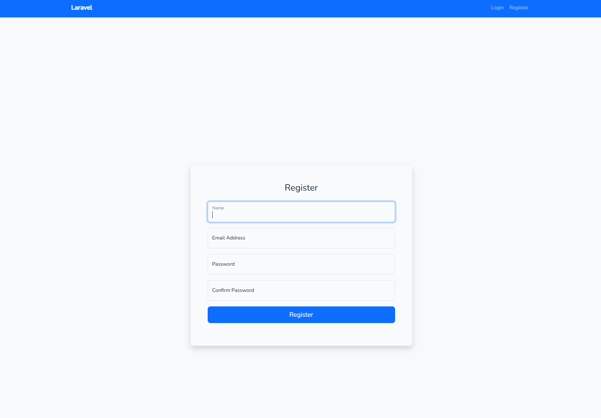
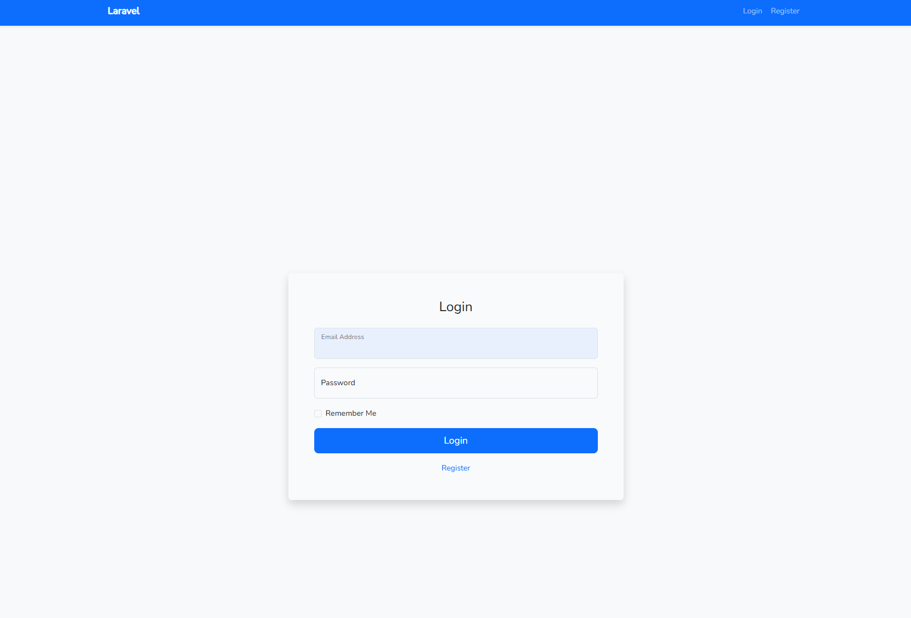
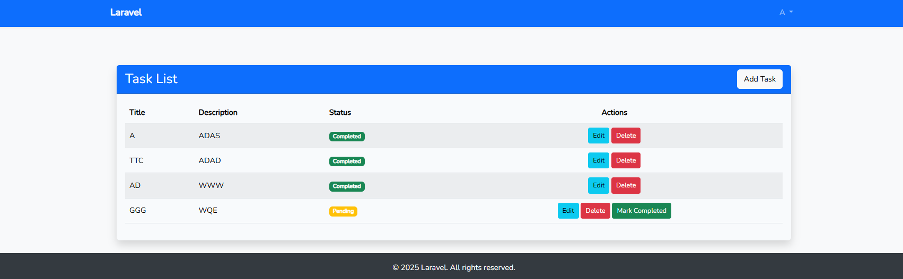
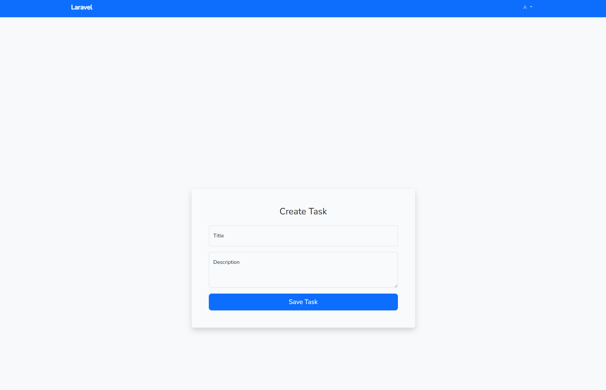
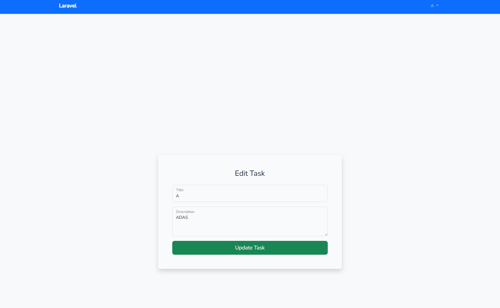

# Task Management System

<p align="center">
  
</p>

## About This App

Task Management System is a simple yet robust application built with **Laravel 12** and **Bootstrap 5**. It allows users to manage their tasks efficiently by providing:

- **User Management:** Register and log in to manage your tasks.
- **Task CRUD:** Create, read, update, and delete tasks.
- **Task Completion:** Mark tasks as completed with a single click.
- **Task History:** Automatically log all task status changes.
- **Event-Driven Actions:** Leverage Laravel events and background job processing.
- **Modern UI:** Responsive, card-based design for a clean and user-friendly experience.

This project was developed as an interview practical to demonstrate proper handling of the task lifecycle, event-driven actions, and background processing using queues.

## Features

- **User Authentication:** Secure registration and login.
- **Task Creation & Management:** Add new tasks, edit existing ones, and delete tasks.
- **Status Updates:** Easily mark tasks as completed.
- **History Tracking:** Automatic logging of task updates.
- **Responsive Design:** Optimized for mobile and desktop viewing.
- **Background Processing:** Use of Laravel queues for smooth operations.

## Tech Stack

- **Backend:** Laravel 12, PHP 8.2
- **Frontend:** Blade Templates, Bootstrap 5
- **Database:** MySQL (or your preferred database)
- **Queue:** Database driver for background job processing

## Setup and Installation

Follow these steps to set up the application on your local machine:

1. **Clone the Repository**
   ```bash
   git clone https://github.com/Drake0306/Task-Management-System.git
   cd task-management-system
   ```

2. **Install Composer Dependencies**
   ```bash
   composer install
   ```

3. **Install Node Dependencies and Compile Assets**
   ```bash
   npm install
   npm run dev
   ```
   *(For production, use `npm run production`.)*

4. **Configure Environment Variables**
   - Copy the example environment file:
     ```bash
     cp .env.example .env
     ```
   - Update the `.env` file with your settings, especially the database credentials.

   **Using Docker for MySQL:**
   - If you don't have a MySQL server installed locally, you can use Docker. Navigate to the `mysql-docker` folder:
     ```bash
     cd mysql-docker
     ```
   - Start the MySQL container with:
     ```bash
     docker-compose up -d
     ```
   - Adjust the database settings in your `.env` file accordingly (host, port, username, password). Typically, the host will be `127.0.0.1` or the name of the Docker service if using Docker networking.

5. **Generate Application Key**
   ```bash
   php artisan key:generate
   ```

6. **Run Database Migrations**
   ```bash
   php artisan migrate
   ```

## Running the Application

Once the setup is complete, follow these steps to run the application:

1. **Start the Laravel Development Server**
   ```bash
   php artisan serve
   ```
   The application will be accessible at [http://127.0.0.1:8000](http://127.0.0.1:8000).

2. **Access the Application**
   Open your browser and navigate to [http://127.0.0.1:8000](http://127.0.0.1:8000). From here, you can register or log in to manage your tasks.

## Quick Explanation

After logging in, you can create, edit, or delete tasks. The application supports marking tasks as completed, with each update automatically logged into the task history. The UI is built with Bootstrap 5 for a modern, responsive experience, and Laravel's event-driven features and background processing ensure smooth operations.

## Demo Screens

### Reg Page
A quick look at the main Reg Page once you log in.


### Login Page
A quick look at the main Login Page once you log in.


### Task List
View all your tasks in a modern, responsive table.


### Create Task
Easily add a new task using the intuitive form.


### Edit Task
Update task details with a clean and modern edit form.


## Contributing

Contributions, issues, and feature requests are welcome! Feel free to check the [issues page](https://github.com/Drake0306/Task-Management-System/issues).

## License

This project is licensed under the [MIT License](https://opensource.org/licenses/MIT).
```

---

This README provides a detailed rundown on what the app does, how to set it up (including using Docker for the database), how to run it, and a quick explanation along with demo screen placeholders. Adjust paths or details as needed for your project.